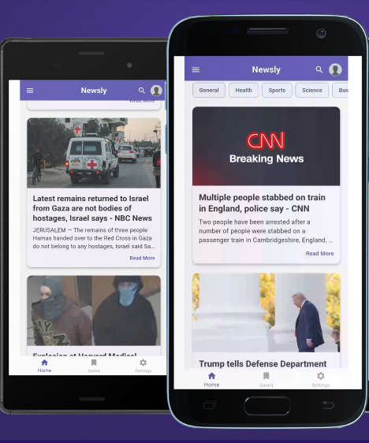
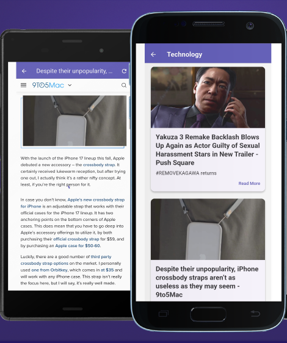

# Newsly - Flutter News App

Newsly is a simple and clean Flutter mobile app for browsing daily top headlines. It fetches news from NewsAPI and displays them in beautiful cards with images, titles, and short descriptions. The app features a modern design with a horizontal category list, side drawer menu, search icon, and bottom navigation for easy navigation.

## Screenshots

## Features

Fetches and displays top general news headlines using NewsAPI
Beautiful news cards with image, title, description, and "Read More" link
Horizontal scrollable category chips (All, Health, Sports, Technology, etc. – selection not fully implemented yet)
Side drawer menu with options like Profile, Home, Categories, Settings
AppBar with menu, search icon, and profile avatar
Bottom navigation bar (Home, Saved, Settings)
Modern Material 3 design with custom purple theme
Loading indicators and error handling for network requests
Placeholder image handling for missing news images

## Technologies Used

Flutter (Cross-platform UI framework)
Dio (For HTTP requests)
NewsAPI (Free API for top headlines – requires your own API key)

## Setup & Installation

Clone the repository:textgit clone https://github.com/yourusername/newsly.git
Get Flutter packages:textflutter pub get
Add your NewsAPI key:
Go to newsapi.org and get a free API key.
Replace the API key in news_service.dart:Dart"https://newsapi.org/v2/top-headlines?apiKey=YOUR_API_KEY_HERE&category=general"

Run the app:textflutter run

## Future Improvements

Implement category selection to filter news
Add news detail screen on card tap
Search functionality
Bookmark/Saved news page
Dark mode support
Pull-to-refresh

This is a beginner-friendly project, perfect for learning Flutter, state management with FutureBuilder, and API integration.

- [Lab: Write your first Flutter app](https://docs.flutter.dev/get-started/codelab)
- [Cookbook: Useful Flutter samples](https://docs.flutter.dev/cookbook)

For help getting started with Flutter development, view the
[online documentation](https://docs.flutter.dev/), which offers tutorials,
samples, guidance on mobile development, and a full API reference.
